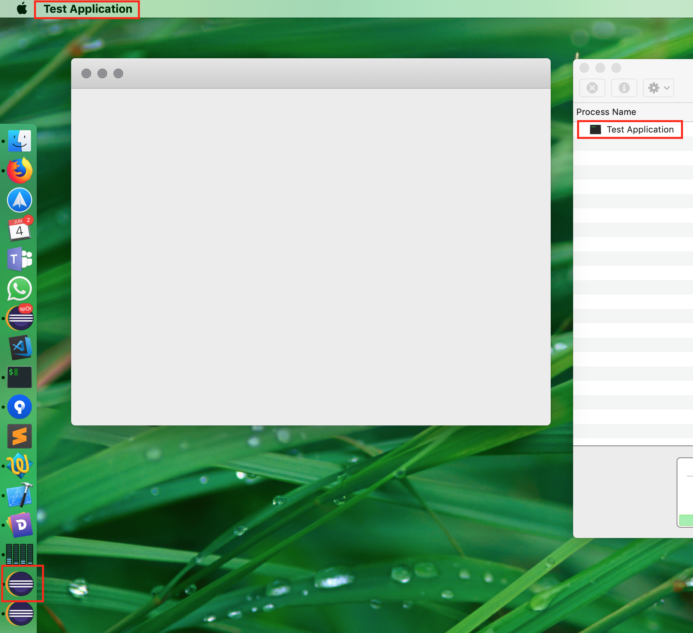

# kakao
Native java UI toolkit for mac (using cocoa)

The idea of this library is to allow java developers to gain access to the native macOS cocoa UI framework without much hassle. The kakao framework provides the basic building blocks, like `NSApplication` or `NSWindow` to start coding your native mac apps.

This framework is currently for personal use only so there's no documentation ;-)

# API usage

This little java codes generates an empty window:

```java
package io.spotnext.kakao;

import io.spotnext.kakao.structs.NSWindowTitleVisibility;
import io.spotnext.kakao.ui.NSToolbar;
import io.spotnext.kakao.ui.NSWindow;
import io.spotnext.kakao.util.ThreadUtil;

public class NSApplicationTest {

	public static void main(String[] args) {
		ThreadUtil.performOnMainThread(() -> {
			final var app = NSApplication.sharedApplication();
			app.setApplicationIconImage("/Applications/Development/Eclipse.app/Contents/Resources/Eclipse.icns");
			app.setApplicationName("Test Application");

			final var window = new NSWindow().initWithDefaults();
			window.setTitle("test");
			window.setTitleVisibility(NSWindowTitleVisibility.hidden);
			window.center();
			
			var toolbar = new NSToolbar();
			window.setToolbar(toolbar);

			app.onApplicationDidFinishLaunching(p -> {
				app.activateIgnoringOtherApps(true);
				window.makeKeyAndOrderFront(null);
			});

			app.run();
		});
	}
}
```

This will produce this application window including a dock icon and a even a process name:


